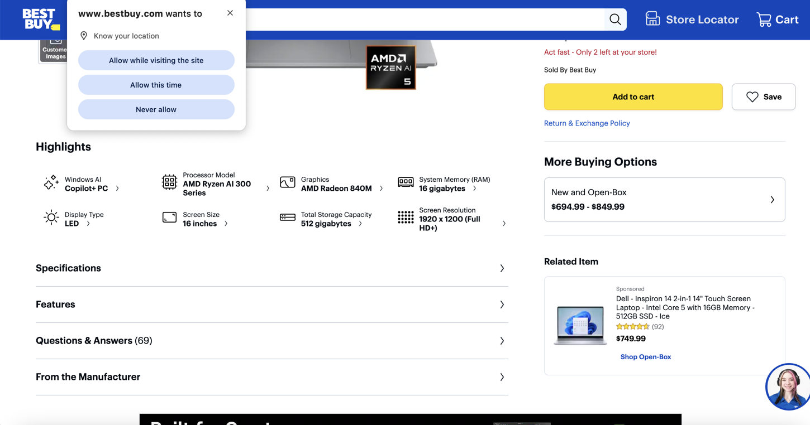

# 🌟Gather-Changed-Segment

Gather changed segment is a program used to find the changes between 2 images. It utilizes Open-CV, scikit-image, and adaptive image processing to find the changed region for 2 images. 

# ℹ️ Overview

Given 2 images returns the bounding box (x,y,w,h), cropped image, and heat map of the changed portion of the images. This program works best with small changes, like changes between video frames or the changes that occur between pressing buttons. 

# 🚀 Usage:

necessary imports:

- pip install opencv-python
- pip install scikit-image
- pip install numpy

    if __name__ == "__main__":
        image1_path = 'webpage_screenshot.png'
        image2_path = 'webpage_screenshot1.png'
    
        image1 = cv2.imread(image1_path)
        image2 = cv2.imread(image2_path)
    
        save_paths = ['heat_map.png', 'changed_image.png']
        print(detect_popup_adaptive(image1, image2, save_paths))

# ⚙️ Example Usage between images:

# Free use!

By, Jacob McCaughrin 

